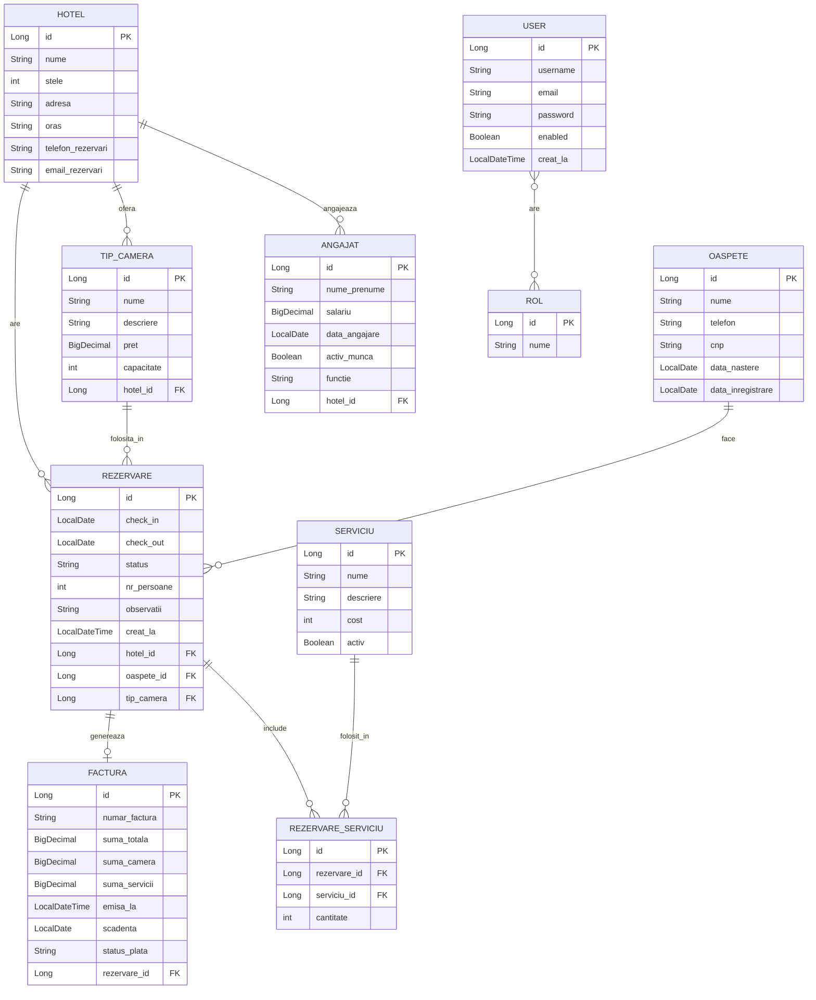

# Hotel Management System
Construită cu Spring Boot, Maven , PostgresSQL 

Echipa va fi formata din:
    1. Costache Alexandra Grabriela
    2. Radu Rareș-Andrei

Descriere proiect:
    -Gestionarea hotelurilor, tipurilor de camere și angajaților
    -Înregistrarea oaspeților și crearea rezervărilor
    -Adăugarea serviciilor extra la rezervări (mic dejun, spa, transfer etc.)
    -Generarea automată a facturilor la check-out
    -Gestionarea furnizorilor pentru fiecare hotel
    -Autentificare și autorizare bazată pe roluri (ADMIN, RECEPTIONER, OASPETE)

Entități 

| Entitate           | Câmpuri stabilite                                                                  |
|--------------------|------------------------------------------------------------------------------------|
| `hotel`            | id, nume, stele, adresa, data_infiintare, create_la                                |
| `tip_camera`       | id, nume, descriere, pret, capacitate, hotel_id                                    |
| `oaspete`          | id, nume, prenume, email, telefon, data_inregistrare                               |
| `angajat`          | id, nume_prenume, functie, email, telefon, salariu, data_angajare, activ, hotel_id |
| `furnizor`         | id, nume, email, tip_furnizor, adresa, activ                                       |
| `hotel_furnizor`   | hotel_id, furnizor_id *(tabel de legătură ManyToMany)*                             |
| `rezervare`        | id, check_in, check_out, status, creat_la, hotel_id, oaspete_id, tip_camera_id     |
| `serviciu`         | id, nume, cost                                                                     |
| `rezervare_serviciu` | id, cantitate, data_folosinta, rezervare_id, serviciu_id                           |
| `factură`          | id, numar_factura, suma_totala, emisa_la, status_plata, rezervare_id               |
| `user`            | id, username, email, password, enabled, creat_la                                        |
    


## Diagrama ER



## Tipuri de relații acoperite

| Tip | Exemplu |
|-----|---------|
| `@OneToOne` | Rezervare ↔ Factura |
| `@OneToMany` / `@ManyToOne` | Hotel → Angajati, Hotel → Rezervari, Hotel → TipuriCamere, Oaspete → Rezervari |
| `@ManyToMany` | User ↔ Rol |


## USER — autentificare Spring Security

### Cookie 1: JSESSIONID

- session cookie, generat automat de Spring
- expiră la închiderea browserului sau după 30 min inactivitate
- NU se stochează în DB (e în memoria serverului)

### Cookie 2: remember-me
- persistent cookie, 14 zile
- setat doar dacă userul bifează "Ține-mă minte" la login
- valoarea hash-uită este stocată în tabelul persistent_logins
- la fiecare request, Spring rotește automat tokenul (securitate)


##  Autentificare — Spring Security

### Cookie 1: JSESSIONID
- Session cookie, generat automat de Spring
- Expiră la închiderea browserului sau după 30 min inactivitate
- Nu se stochează în DB (e în memoria serverului)

### Cookie 2: remember-me
- Persistent cookie, valabil 14 zile
- Setat doar dacă userul bifează **"Ține-mă minte"** la login
- Valoarea este stocată în tabelul `persistent_logins` din DB
- La fiecare request, Spring rotește automat tokenul

## Roluri și permisiuni

| Rol | Acces |
|-----|-------|
| `ADMIN` | Toate paginile, inclusiv `/inventar-camere/**` și `/angajati/**` |
| `RECEPTIONER` | `/angajati/**`, `/facturi/**`, plus paginile de baza |
| `USER` | Hoteluri, oaspeti, rezervari, servicii |

**Cont admin implicit:** `admin` / `admin123`

## Multi-Environment Configuration

| Profil | Baza de date | Activare |
|--------|-------------|----------|
| *(implicit)* | H2 In-Memory | `mvn spring-boot:run` |
| `dev` | PostgreSQL | `mvn spring-boot:run -Dspring-boot.run.profiles=dev` |
| `test` | H2 In-Memory (izolat) | folosit automat de `mvn test` |

Fisiere de configurare: `application.properties`, `application-dev.yml`, `application-test.yml`

## Paginare și sortare

Implementata pentru: **Hotel**, **Oaspete**, **Rezervare**, **Angajat**

Criterii de sortare: `nume`, `stele`, `oras`, `checkIn`, `checkOut`, `status`, `salariu`, `dataAngajare`

## Testare

```bash
mvn test
```

- **Unit tests** (Mockito): `HotelServiceTest`, `RezervareServiceTest`, `OaspeteServiceTest`
- **Integration tests** (H2 + MockMvc): `HotelIntegrationTest`, `OaspeteIntegrationTest`, `SecurityIntegrationTest`

## Logging

| Fisier | Continut |
|--------|----------|
| `logs/hotel-app.log` | Toate evenimentele (INFO+) |
| `logs/hotel-errors.log` | Doar erorile (ERROR) |

Nivel DEBUG activat pentru pachetul `com.hotel`.

##  Setup & Rulare

###  Programe necesare

- Java 17+
- Maven 3.9+
- PostgreSQL 15+ (doar pentru profilul `dev`)

Cloneaza repository-ul:

```bash
git clone https://github.com/RaduRares/Proiect-AWDB-Hotel
cd hotel-management
```

H2 Console (implicit): `http://localhost:8080/h2-console`  
URL JDBC: `jdbc:h2:mem:hoteldb` | User: `sa` | Parola: *(goala)*

!!!! INAINTE DE FIECARE PUSH, A NU SE UITA SA SE FACA PULL PENTRU A MINIMIZA MERGE CONFLICTS !!!!!!!
## Structura proiectului
```

hotel-management/
├── src/
│   ├── main/
│   │   ├── java/com/hotel/
│   │   │   ├── model/              # Entități JPA (11 clase)
│   │   │   ├── repository/         # Spring Data JPA repositories
│   │   │   ├── service/            # Business logic
│   │   │   ├── controller/         # REST Controllers
│   │   │   ├── security/           # Spring Security config
│   │   │   ├── exception/          # Exception handling
│   │   │   └── HotelManagementApplication.java
│   │   └── resources/
│   │      
│   │      
│   │      
│   │      
│   │       
│   └── test/
│       └── java/com/hotel/
│           ├── service/            # Unit tests 
│           └── integration/        # Integration tests
├── logs/
│   ├── hotel-app.log               # Log general
│   └── hotel-errors.log            # Doar erori
├── pom.xml
├── .gitignore
└── README.md

```
```
main   ← cod stabil
└── dev ← development activ
```

---